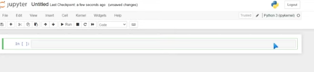

# Data-Analytics-Training

### Excel

MAX: =max(H2:H10)

MIN: =min(H2:H10)

#### IF
=IF(logical test,[value_if_true],[value_if_false])

=IF(D2:D10>30,"Old","Young")

#### IFS

You can use this when you have multiple condition

=IFS(F2:F10="Salesman","Sales",F2:F10="HR","Fire Immediately",F2:F10="Regional Manager","Give Christmas Bonus")

* Another IFS statement

* 1-9 = 6000
* 10-19 = 7000
* 20-29 = 8000
* 30+ = 9000

=IFS(D5<=9,6000,D5<=19,7000,D5<=29,8000,D5>=30,9000)

* Another IFS statement

* If D5 is 9 or less → "1-9 Sales"

* If D5 is between 10 and 19 → "10-19 Sales"

* If D5 is between 20 and 29 → "20-29 Sales"

* If D5 is 30 or more → "30+ Sales"

=IFS(D5<=9,"1-9 Sales", D5<=19,"10-19 Sales", D5<=29,"20-29 Sales", D5>=30,"30+ Sales")

#### LEN
This can be used to see the difference between 100s and thousands. It can be used to find bad social security numbers if they are 10 digits instead of 9

=LEN(C2:C10)

#### LEFT & RIGHT

=LEFT(B2:B10,3)
This will take the first 3 characters

=RIGHT(A2:A10,1)

=RIGHT(H2:H10,4)

#### DateToText

=TEXT(H2:H10,"dd/mm/yyy")

#### TRIM
This removes all spaces from the text string except for single space between words

=TRIM(C2:C10)

#### Concatenate
This is used to join two or more text strings into one string

=CONCATENATE(B2,"",C2) 
This is used to combine FirstName and Lastname

=CONCATENATE(B2,"_",C2,"@gmail.com")
This is used to generate email

#### Substitute
It replaces existing text with a new text in a text string

=SUBSTITUTE(H2:H10,"-","/")

=SUBSTITUTE(H2:H10,"/","-",1)

#### SUM

=SUM(G2:G10)

=SUMIF(G2:G10,">50000")
This will only add up if salary is greater than 50,000

=SUMIFS(G2:G10,E2:E10,"Female",D2:D10,">30")
This will only add up the salary if the gender is female and the age is greater than 30

#### COUNT

=COUNT(G2:G10)
This is to count the number of cells

=COUNTIF(G2:G10,">45000)
This is to count how many people has the salary of over 45,000

=COUNTIFS(A2:A10,">1005",E2:E10,"Male")
This is to count numbers of male employees whose employee_id is greater than 1005

#### DAYS

=DAYS(end_date,start_date)

=DAYS(I2,H2)

#### NETWORKDAYS

=NETWORKDAYS(start_date,end_date,[holidays])

#### XLOOKUP
This searches a range or array for a match and returns the corresponding item from a second range or array. By default, an exact match is used.

=XLOOKUP(lookup_value,lookup_array,return_array)

=XLOOKUP(A3,H2:H10,P2:P10)

> Note: Old fashion versions of MS-Office does not support XLOOKUP, you can then use the INDEX and MATCH in this case

=INDEX(P2:P10, MATCH(A3,H2:H10,0))

#### Text to Columns
The Text to Columns feature in Excel is used to split data in a single column into multiple columns based on a specific delimiter (such as commas, spaces, or tabs) or a fixed width.

Steps to Use Text to Columns in Excel:
* Select the Data

* Click on the column that contains the text you want to split.
* Open the Text to Columns Wizard

* Go to the Data tab on the ribbon.
* Click Text to Columns.
* Choose the Data Type

* Delimited: Choose this if your data is separated by commas, tabs, spaces, or other characters.
* Fixed Width: Choose this if the data has a consistent structure with columns of equal width.
Specify Delimiters or Set Column Widths

* If you selected Delimited, choose the delimiter (Comma, Tab, Space, Semicolon, or Other).
* If you selected Fixed Width, manually set column break lines.
Format and Finish

* Choose the Column Data Format (General, Text, Date, etc.).
* Select where you want the new columns to appear (default is the same column).
* Click Finish.

#### To create a formula in Google Sheets that highlights a cell red if the price is higher than a specific amount, use Conditional Formatting. Here's how:

Step-by-Step Guide:Select the cells you want to apply the rule to (e.g., prices in column B).

* Click on Format in the top menu.

* Select Conditional formatting.

* In the right-hand panel:

* Under Format cells if, choose "Custom formula is".

* Enter this formula (replace 100 with your specific threshold and adjust the cell reference if needed):

* =B1>100
* Choose a red fill color under the Formatting style.

* Click Done.

If you want cells in range B2:B100 to turn red when the price is greater than $50:

Select B2:B100

Use the formula: =B2>50

## Power BI

The three main components of Power BI are:
1. Power BI Desktop
2. Power BI Service
3. Power BI Report Builder

Power BI Desktop has 3 views: 
* Report view: This is wher you load your data in. In the middle of your screen where it says build visuals with your data is known as the canvas
* Data view: 
* Modeling view:

**Heirarchy:** This is the container of sorts that you would like to group together. For instance a Date Hierarchy can be broken dowun into: Year, month, day & Quarter

Databases usually have four different objects in them. The tables are the only object that holds data, there could also be queries, forms and reports. There could be macros and modules as database objects.

Icons for queries looks like a double table icon

File - Options & Settings - Options - Current - Data load - Relationships - Checkmark all three boxes under it. 

To import a data from the Internet: Copy the URL click on Get data - other - web - paste the url - 

#### Optimizing Performance
If you connect to data source, it's only going to bring in the from an excel file that resides in the excel application. If you want to bring in the other data you are going to have to import the file into Power BI. For instance the **customer data** 

If you inherit a file with a power pivot model in it and you don't have power pivot, Power BI can access the data model.

Open the Customer Data file in Excel. Click on Power Pivot - Manage. This will take us into the Power data pivot model, this is the underlying data that is providing subsets of itself for the pivot table in the Excel application. i.e feeding the pivot tables in the Excel application. If we want to look at the relationships here, Up on the ribbon we go to **diagram view** 

the diagram view is similar to model view in Power BI

File - Import - Power Query, Power pivot, Power view - Select Customer Data

Knowing when to import data versus when to connect data will optimize your performance in Power BI. If we didn't import the data model data, we will have to the data tables that we didn't import from excel, which is the subset of the overall data, and we would have to merge them together to get a complete picture of the data. 

If you make a change in the locally stored file, Excel file in particular, and you refresh in Power BI Desktop, it will update the information

//////////////////////////////////////////////////////////////////////////////////////////////////////////

Once you open Power Bi click on Get data or Blank report 
* Click on get data from another source
* Click on e.g. Excel workbook and then click on connect
* select your file
* Under the Navigator, select the sheet you want to use
* Click load or transform
* After loading your file, click on report tab from the left hand side. This is where we will build our visualization. 
* Go to the visualization section on the right hand side
* select the columns you want to visualize under the field and then select the visualization type you want
* To add Legend, drag and drop the store column in side the legend under the visualization section.

We are trying to find out which store we are spending the most amount of money 

For the second 
* we will select product. price, and store
* select the clustered column charts

This will show show us how much we are paying per store for each product

* To change the title of the charts, click on the each chart and then click on format your visual in the visualization section
* Click on General
* Click Title and then give the desired name you want 

* Click on Visuals
* toggle on **Data labels** it actual rounding the numbers but to change this to an actual number
* Click on Data labels,  Click on **Values**, **Display Unit**
* change the Auto to none

### How to use Power Querry in Power BI
* Pull both the **purchase overview** and the **pivot table** sheet
* Click in Transform (on the left hand side under the **Querry** you can toggle between the two sheets) On the far right side you have the **Querry settings**
* Click on Transform from the Menu bar and select use first row as Header after deleting the first two empty rows
* Filter the first column and remove empty rows
* Filter the second column and use **Text filters** to remove the Total in the column using **Does not contain** you will then type in the text you don't want
* Remove the last column which is the GrandTotal 
* Select the last four columns(dates column) and click on **Transform tab** and click on **Unpivot columns** 
* After that change the datatype to date
* Change the value to Product cost and the location to Store
* Select the pivot table
* Change the first row to column
* select Jan to April column and unpivot it
* Click on close and apply

### How to Create and Manage Relationships in Power BI
* After the data has been loaded
* select the three sheets
* Click on Model

Note: Change the cross filter direction to both, under the edit relationship

After creating the relationships between the three tables, we want to know how many product ids are being in the different states. 

* We will create a new measure (click on new measure from Table tools), type count(select apocalypse store product ID)
* you will then click on the checkmark to create it.
* **Measure** is then added under the apocalypse store.

### How to use DAX (Data Analysis Expressions)
DAX is a library of functions and operators that help you build formulas. You can use it to create measures and calculated columns within Power BI.

We will be using New measure and New column under the Table tools to create our DAX function

* Go report
* Right click on Apocalypse sales and select new measure. we can rename the measure to **count of sales** 
* Next, we want to know our big product that is selling
* select product name
* Right click on Apocalypse sales and select new measure. we can rename the measure to **Sum of product sold** 
* Input =sum(unit prize)

Adding **x** to a sum, average e.t.c can make them an iterator function

//////////////////////////////////////////////////////////////////////////////////////////////////////////////

### Join Types in Power BI
1. Left Outer: All the records from first the table and only the matching records from the second table.
2. Right Outer: All the records from second the table and only the matching records from the first table.
3. Full Outer: All rows from both tables.
4. Inner: Only matching rows
5. Left Anti: Rows only in first table
6. Right Anti: Rows only from second table.

Data Shaping means transforming the data by renaming columns or tables, removing rows, setting the first rows as headers

Merging information from one table into another table, but they must have one column in common. 
* Click on Transform data - Combine - mergge queries - merge queries as new
* Select the common field from the first table 
* Select the sceond table and select the common field
* Under Join kind, select right outer
* Click OK
* You will notice you now have a new query on the left side of your screen and it gives it a default name of Merge1

#### Data Profiling
Data profiling tools are tools that can be used to give an in-depth assessment of the quality of your data
* Transform data - view tab - Data Preview - 
* Show whitespace is always checkmarked by default, you can then checkmark the rest to check the quality of your data

#### Data Modeling
This can b defined as making the data you use in Power BI as accurate and intentional as possible. This module has several lessons:
* **Working with tables:** Like formating changes e.g the discount column to be formatted as percentage. We are going to want unit price and shipping costs columns to be formatted as currency. 
    * Click on any cell in the discount column and you will notice you'll get a new tab on ribbon called **column tools** click percentage icon in the formatting group
    * We will change the order date format too
    * We will categorize some location fields for mapping purposes, such as region, state, cities, postal code fields. There are mapping visualization that will give more data about a location if those location columns are categorized. 
    * Select any cell in the region column and on the same column tools tab in the properties group you will see **data category** 
    * Categorize State or province, postal code, 
    * Another optimizing performance tip is breaking down your tables when applicable. One large table is not the answer for an effective data model.
    * **Fact Tables:** It keeps numeric data that might be aggregated in reporting visualizations. e.g., Sales, Profits
    * **Dimension Tables:** It keeps descriptive information that can slice and dice the data in the fact table.
      * It requires a key field. e.g Customer Info, Product Info
    * A golden rule is that you should not have fact and decscriptive fields in the same table. By breaking down your tables more efficiently, you will optimize the performance of your data set.
    * We will now breakdown the order table: We will make a copy of the orders query and transform it into a customer's dimension query. In the query pane on the left, right click on orders, click copy, right click on an empty space in the pane and paste. 
      * You will then use the new order table as customer dimension table. Select columns the begins with customer, you then select other columns such as: state, region, city, postal code, discount - select some few columns 33.20 (intermediate) You will then rename the DimCustomer. A dimension table has to have field key, this table already has which is Customer ID
      * You will then make another copy of the orders table and then choose four columns that begins with product and include them only in the new table. you will then rename it DimProducts. This table doesn't have a field key, so we will have to create one.
      * We will then create another column that we can assign a numeric value to each unique product name.
      * Click on Add column - Index column - Custom -choose your starting number e.g. 001 and type the increment number e.g. 1 click OK
      * Save your changes and load them back into the data model in Power BI desktop.
      * The next thing is to create an heirarchy based on the region, field in the orders table.

* **Dimensions and Hierarchies**
    A heirarchy is a container of sorts, a way of grouping related fields together. When creating  a heirarchy, you want to start with the broadest category in terms of column and end with the narrowest category. In order to do this this 
  * We right click on **region** in the fields pane under the **orders table** and we are going to select **create Hierarchy**
  * Now, we want to add the next broadest category after **region** that would be **state** Right click on **State** hover over **add to hierarchy** and click on **region hierarchy**
  * We are going to add two more fields to the hierarchy. Right click on **city** **add to hierarchy** click on **region hierarchy** and do the same for the **postal code** field

* **Create Model Relationships**
    * One-to-One (1:1): One manager has one region
    * One-to-Many (1:*): One customer has many orders, the most common
    * Many-to-One (*:1): Same as above
    * Many-to-Many (*:*): Many students are in many classes(not applicable to our data)

* **Review the Model Interface**
    * A featured table is an easy way to share specific table information with other users, either through workspaces and online spaces 

* **Enforce Row-level Security (RLS)**
    RLS in Power BI can be used to restrict data access for given users. Filters restrict data access at the row level, and you can define filters within roles. In the Power BI service, members of a workspace have access to datasets in the workspace. RLS doesn't restrict this data access. In Desktop, you set up the security roles and in the Service, you assign users to those roles.

    * We are goint to set up a role that allow users that are assigned to that role to view order information just for the east region. 
    * We will be using the **modeling tab** on the Ribbon 
      * Click on **Modeling**
      * Go to **Security** 
      * Click on **Manage roles**
      * Click on **New**
      * Double click on Untitled and rename it East
      * You will then click the **orders** table to let it know that you are using a field from the orders table
      * To the right you are going to put in a simple DAX expression and click on **Switch to DAX editor**
      * You will then type [region]="East". What this means is for this role called **East** it only allow users that are assigned to it to see the Eastern region information from the **Orders** table
      * Click save

#### How to Publish in Power BI
* Click on **Publish**
* Input your company email and click continue
* Click continue
* Select My workspace
* It will publish both the report(the one with bar) and dataset

* You can then go to my workspace in your Power BI service 

#### To Assign Roles to our East an West
* Hover over the dataset and click on the vertical/horizontal ellipsis more option button
* Select security  
* You will then see the groups you have created e.g East and West
* Select one of them and go to the **members** area 
* You will then add people or groups email addresses you want to give access toClick add

#### DAX (Data Analysis Expressions)
DAX is a library of functions and operators that help you build formulas. You can use it to create measures and calculated columns within Power BI.

DAX is a collection of functions, operators, and constants that can be used in a formula, or expression, to calculate and return one or more values.

DAX context enables you to perform dynamic analysis, in which the results of a formula can change to reflect the current row or cell selection and any related data.

##### Create Calculated Tables
We want to use distinct function in DAX to create a calculated table that will return one column of all the distinct order IDs from Orders table.
* Go to Modeling tab - Under calculations - Click New table
* Name the table **Distinct Order Count** (what we really want is a count of the distinct order IDs in the orders table) Distinct here means the total number of different values, regardless how many times  those values appear in the table. 
* Distinct Order Count = DISTINCT(Orders[Order ID])

In the context of data, the term **distinct** refers to unique values in a dataset, meaning values that appear only once or without duplicates. So the DAX distinct function returns a one column table populated with distinct values.

##### Create Calculated Columns
We want to calculate the difference between the order date and the shipment date. We will be using the **DATEDIFF** function
* Right click Orders table from the fields pane
* Select new column
* Rename it Days to ship
* Syntax: Days to Ship = DATEDIFF(Orders[Order Date].[Date],Orders[Ship Date].[Date],DAY)

Let's creat another calculated column that shows ranking by sales, using the **RANKX** function. We want to do the ranking of the sales field in the orders table 

* Click on orders from the fild pane
* From the **Column Tools** tab click on New column
* Rename it **Sale Ranking Lowest** 
* Sales Ranking Lowest No Skip = RANKX(Orders,Orders[Sales],,ASC,Dense)
* 

##### Create Quick measures
Measures could be called virtual calculations, they don't become part of your data set, they only calculate when you add them to a report visualization.

If a file size is an issue, you may want to use measure instead of calculated columns or calculated tables.

There are two variations of measures: (i) Quick measures which are templates of sorts (ii) There are measures we build from scratch

We want to create a quick measure in Orders table that will give us the average sales based on customer segment

* Right click on Orders table in the field pane
* Select New quick measure.
* A dialog box will open
* Select the calculation type you want. In this case we will select **Total for category (filters not applied)
* For the **Base value** 
* We will expand the **Orders table** and we will drag the **sales** field into the base value text box. We will click on the more option button, click on more option button under **Summerization** and select **average**
* For **Category** in the field list, we are going to drag the **customer segment** field into the category box
* Click on **add**
> Note: It won't become part of your data set, so when you do a calculate column, it puts it at the end on the right of your dataset. However, you will your measure in the field pane and notice the icon in front of it that represent that it is a measure. You won't see this in a data view, you can only see it on a report visualization.
>

Now we are goint to calculate a measure from scratch to calculate the average sales per product category for the orders table.
* Right click on orders.
* Click new measure, it will take us to the formular bar.
*  We will name it **Average sales per product category** 
*  Average sales per product category = CALCULATE(AVERAGE(Orders[Sales]),ALLSELECTED(Orders[Product Category]))

> **ALLSELECTED** returns all rows in a table, or all the values in a column, ignoring any filters that might have been applied inside the query, but keeping filter that come from outside.

##### Working with Time Intelligence Functions and Key Performance
In order to use **Time Intelligence Functions** in Power BI, you have to have what is known as a **date table** in your data model. We don't have a date table in our data model, so we will create one. There are two different DAX functions that we can use to do this. Which are: 
**(i) Calendar function** For the calendar function to work you have to provide it with a start and an end date, and it will build a table for you with one column with all of those dates.

**(ii)calendar auto** This is the second function and that one can scan your data and determine the earliest date and the latest date in your data model.

Wer are going to use calendar auto. It will return one column with all of the dates in the data model. After we create that table, we are going to amend it by adding other columns. Let's get started:

* Select orders in your field pane
* From **table tools** ribbon, click on **new table**
* In the formular bar, we will double click on the word table and rename it **dates**
* Dates = CALENDARAUTO()
  * this displays our earliest date and the latest date in our data model and every dates in between is in one column in this new table.
* In addition to having the full date column, we would like in this table to have the year of each date in a separate column, as well as the quarter and the month in two different ways.
* So we are going to nest our **calendar auto function** within an **add column function** 
* And to do that, you will click after the equal sign right before **calendar auto** in the formular bar. 
* And you start typing: 
  1. Dates = ADDCOLUMNS(CALENDARAUTO(),"Year",YEAR([Date]),
  2. "Quarter","Q"&QUARTER([Date]),
  3. "Month",FORMAT([Date],"mmmm"),
  4. "Month Number",MONTH([Date])
  5. ) press enter
  6. In the field pane right click in Datee table
  7. Select **mark as date table**
  8. Select **Date**
  9. We need to relate the **dates table** to our **orders table**
  10. Click on Model view 
  11. From the orders table, we will drag **order date** and drop it on the **date** in the dates table.
  12. And that will create many to one relationship 
  
We are going to add two more calculated columns to our data, for the orders table. We want to show the end of the month for each order and another to show the end of the quarter for each order. 

One of a time intelligence functions in Power BI is **end of month** 

* Right click on orders table
* Name it **end of month** 
* End of Month = ENDOFMONTH(Orders[Order Date])

* Right click on orders table
* Name it **end of quarter** 
* End of Month = ENDOFQUARTER(Orders[Order Date])

Let's go ahead to format these two columns so they match the order and ship date column formats.

* Click on the **End of Month** column 
* Go to the column tools tab, click on the dropdown button under **format**
* Select the date format that says: **March 14, 2001 (mmmm d, yyyy)**
* Do the same for **End of Quarter**

##### Creating KPI Visualization
Key Performance Indicator (KPI) ia a key indicator of progress toward an intended result. It's a visualization tyoe in Power BI 

* From the report view, add new page 
* From the field pane, expand the sales table 
* We will drag the **total units this year** into the centre of the screen.
* We will expand the **Time table** in the field pane and we will drag the **fiscal month** field into the the highlighted box on the kansas 
* We would perform a sort before turning it into KPI visualization 
* We will sort this in ascending order by fiscal month 
* In the upper right corner of the visualization, you will see the more option vetical ellipsis icon
* Click on Sort axis
* Select fiscal month and then select ascending 
* In the visualization pane look for the KPI visualization and click on it. 
* We need to add a field for target goals. We will then drag **Total unit last year** and drop it into the **Target** box
* The shaded area is our goal, it tells us the value and the goal, it also gave the percentage difference
* Rename the page to KPI  

##### Optimizing Model Performance 
If file size is a consideration and the data is very large and/or data is changing frequently and reports must reflect the latest data, use **DirectQuery.** 

**DirectQuery** connects directly to data in the original source repository (SQL server, Azure Analysis Services, etc.) and no data is imported into Power BI. When visualizations are created, queries are sent to the underlying data source to retrieve necessary data. 

Upon refresh, the necessary queries are resent for each visual for updating.

When publishing reports to the service, you will see a dataset as well as the reports, however, no data is included in the dataset.

One of the data sources that you can use DirectQuery on is Power BI dataset. In order to do this, that dataset needs to be published to the service.

> Note: Data Sources that are supported with DirectQuery, depending on which one you choose, you are going to have to do something different. For instance,
> Sequel server is a data source that is supported by DirectQuery
>

We want to access direct query from a new Power BI file. 
* Click on File 
* Select New 
* On the Home tab under Data, click on **OneLake catalog** or **Get data** 
* Select Power BI semantic models or Power BI dataset. It will only show you the datasets that are published to the service
* Click on Retail Analysis Sample 
* Click the create or connect button 
* Let's save it and name it DirectQuery

There is no data view because it didn't bring in any data from the underlying source 

We are going to recreate the KPI report 

>Note: You have to sort befor turning it into KPI, because the KPI doesn't allow sorting 

* We will drag the **total units this year** into the centre of the screen.
* We will expand the **Time table** in the field pane and we will drag the **fiscal month** field into the the highlighted box on the kansas 
* Click on More option in the upper right-hand corner of the visualization
* Click on sort axis and select Fiscal Month
* Go back again and click on sort ascending 
* In the visualization pane look for the KPI visualization and click on it. 
  * When we did that, it actually sent a question to the underlying data source to retrieve the information for this visualization 

##### What are Variables?
As a data modeler, writing and debugging some DAX calculations can be challenging. It's common that complex calculation requirements often involve writing compound or complex expressions. Compound expressions can involve the use of many nested functions, and possibly the reuse of expression logic. Using variables in your DAX formulas helps you write complex and efficient calculations.

You can store the result of an expression as a named variable, which can then be passed as an argument to other measure expression, thosevalues do not change, even if the variableis referenced in another expression. 1:05:16

## Python 
After downloading the app from anaconda.com You install it, You click on Anaconda Navigator, Launch Notebook (jupyter), Click on New and select Python (ipykernel). A new page will be opened  this is where we will write all of our codes. 

To give it a header e.g Variables select markdown and type # Variables.

Type print ('Hello world') press **Shift+enter** to run it

### Variables in Python
* x = 22
* print (x)   //22

* y = 'mint chocolate chip'
* print (y)  // mint chocolate chip

Variables are case sensitive, we can assign multiple values to multiple variables

* x,y,z ='chocolate', 'vanilla', 'rocky road'
* print (x)
* print (y)
* print (z)

Assigning multiple variables to one value

* x = y = z = 'Root bear Float'
* print (x)
* print (y)
* print (z)

We can also assign list, sets, and tuples all to variables

* ice_cream = ['chocolate', 'vanilla', 'rocky road']
* x,y,z = ice_cream
* print (x)
* print (y)
* print (z)

#### Method of naming a variable 
* Camel case method of naming a variable e.g. 
* * testVariableCase = 'vanilla'
  
* Pascal case
*  * TestVariableCase = 'vanilla'

* * Snake case (Best practises b/c it enhances readability)
*  * test_variable_case = 'vanilla'

* x = 'Ice cream'
* y = ' is'
* z = ' my favourite'
* print(x+y+z)

### Data Types in Python
* Numeric: 3 types of numeric data type: integer, float & complex numbers.
* Sequence type: It includes list, strings & tuples
   * Strings are arrays of bytes representing unicode characters. When you are using string you are putting them in either double or single quote.
* Set
* Boolean: It has only two built-in values either True or False
* Dictionary